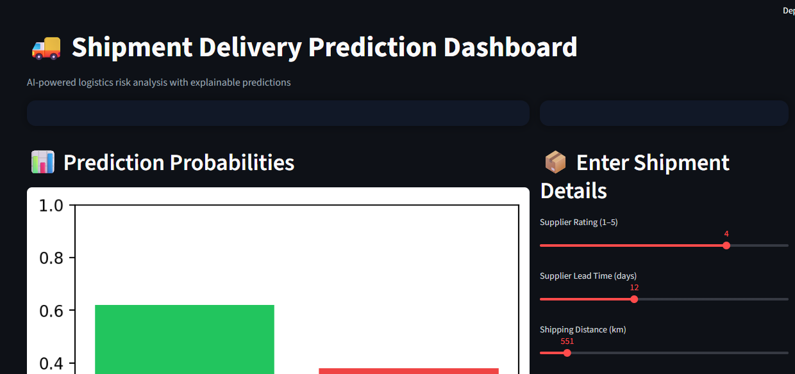

# 🚚 Shipment Sure – Shipment Delivery Prediction System

An AI-based and explainable machine learning system that predicts whether a shipment will be delivered **On-Time or Delayed** using supplier and logistics data.

---

## 📌 Problem Statement
Shipment delays cause customer dissatisfaction and increased operational costs in logistics.  
Traditional systems fail to predict delays accurately and lack transparency.  
This project aims to build an **intelligent and explainable ML system** to predict shipment delays and support proactive decision-making.

---

## 🎯 Goal of the Project
- Predict shipment delivery status (On-Time / Delayed)
- Provide confidence scores for predictions
- Explain predictions using Explainable AI (SHAP)
- Present insights via an interactive dashboard

---

## 🔑 Key Features
- Machine Learning–based delay prediction
- End-to-end ML pipeline
- Explainable AI using SHAP
- Interactive Streamlit dashboard
- Prediction probability and confidence score
- Prediction history tracking

---

## ⚙️ How the System Works
1. User enters shipment details
2. Data is preprocessed using a trained pipeline
3. ML model predicts delay risk
4. Prediction probabilities are calculated
5. SHAP explains feature impact
6. Results are visualized on the dashboard

---

## 🧱 Project Structure
Shipment-Sure/
│
├── app/ # Streamlit application
├── data/
│ ├── raw/ # Raw dataset
│ └── processed/ # Cleaned datasets
├── models/ # Trained ML models
├── notebooks/ # Model training notebooks
├── scripts/ # Data cleaning scripts
├── presentation/ # Project PPT
├── requirements.txt
├── README.md
└── LICENSE

yaml
Copy code

---

## 🛠️ Tech Stack
- Python
- Scikit-learn
- Pandas, NumPy
- Streamlit
- SHAP
- Matplotlib

---
## 📸 Dashboard Preview

### 🔹 Dashboard Overview


### 🔹 Shipment Input & Predict Action


### 🔹 Prediction Output & History


### 🔹 Explainable AI – SHAP Analysis


### 🔹 Model Evaluation – Confusion Matrix


## ▶️ How to Run the Project

```bash
pip install -r requirements.txt
python -m streamlit run app/shipment_streamlit_app/app.py
📊 Evaluation Metrics Used
Accuracy

Precision

Recall

F1-Score

Confusion Matrix

ROC-AUC

📈 Milestones Covered
Milestone 1: Problem understanding & data preparation

Milestone 2: Feature engineering & preprocessing

Milestone 3: Model training & evaluation

Milestone 4: Deployment & explainability

👩‍💻 Author
Darshini ML
BE – Computer Science & Engineering

📄 License
This project is licensed under the MIT License.

yaml
Copy code

Save the file (`Ctrl + S`).

---

## 🔹 Step 3: Push README to GitHub

```powershell
git add README.md
git commit -m "Added professional README for project documentation"
git push origin Darshini-Ml
